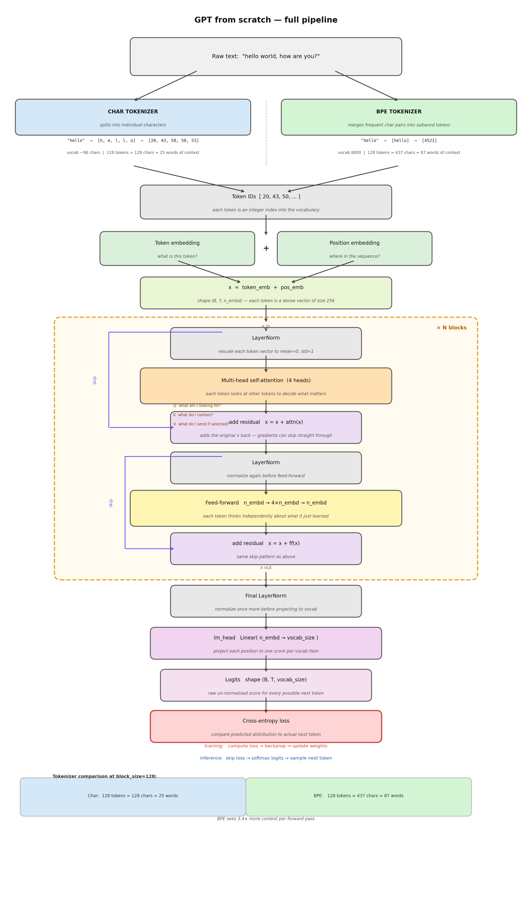

# gpt-from-scratch

Building a GPT from scratch on a MacBook with 8GB RAM. No shortcuts.

## Why
I wanted to understand how LLMs actually work. Not use one. Build one.

## Hardware
MacBook, Apple Silicon, 8GB unified memory. MPS backend for PyTorch.

## Progress

### Stage 1 — Bigram model
- Character-level tokenizer. 65 unique chars.
- 4,225 parameters. Just an embedding table.
- Val loss: 2.50
- Output is garbage but structured garbage. It learned basic char patterns.

### Stage 3 — Full transformer
- Added embeddings, self-attention, feed-forward, LayerNorm, residuals, stacked blocks.
- 12.7M parameters.
- Val loss: 1.54 at 5k steps.
- Generates valid dialogue structure. Not real Shakespeare but close enough to see it's learning.

### What I learned so far
- The feed-forward layer does more than attention. Attention decides where to look, FF does the reasoning.
- Loss table per component is the best way to see what actually matters.
- 8GB is enough if you stay under 15M params.

## What's next
- Stage 5: Train on mixed corpus — screenplays, song lyrics, news articles.
- Option C: Compare BPE tokenizer vs char tokenizer on same corpus.

## Files
- `bigram.py` — Stage 1, bigram model
- `transformer.py` — Stage 3, full GPT
- `download_corpus.py` — Stage 5, pulls books/lyrics/news from HuggingFace
- `train_bpe.py` — Stage 5, trains BPE tokenizer on corpus
- `compare.py` — Stage 5, trains char and BPE models and compares
- `diagram.py` — generates the pipeline diagram
- `diagram.png` / `diagram.svg` — pipeline diagram

### Stage 5 — BPE vs Char tokenizer on mixed corpus
Corpus: books (Gutenberg), song lyrics, news articles. ~20MB, ~5M chars.

| Metric | Char | BPE |
|---|---|---|
| val_loss (raw) | 1.73 | 4.81 |
| val_bpc (fair comparison) | 2.49 | 2.04 |
| vocab size | 96 | 8000 |
| context (chars) | 128 | 436 |
| tok/s | ~20,000 | ~13,000 |

BPE wins by 18% on BPC. Consistent from step 500 onward, not a fluke.

What I learned:
- Raw val_loss is misleading across tokenizers. BPC is the honest metric.
- The context window advantage is real and intentional — that's what you 
  actually get with BPE in practice.
- Char output sounds more fluent at surface level. BPE generates real words 
  but loses coherence over longer spans.
- We trained BPE fresh on this corpus. A pre-trained modern tokenizer 
  on historical text would fragment rare words worse.