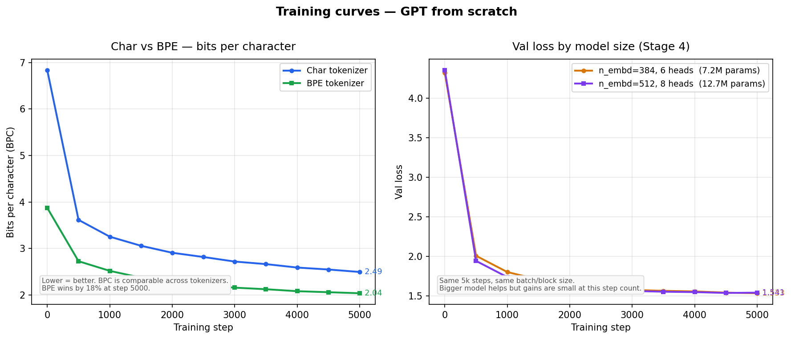
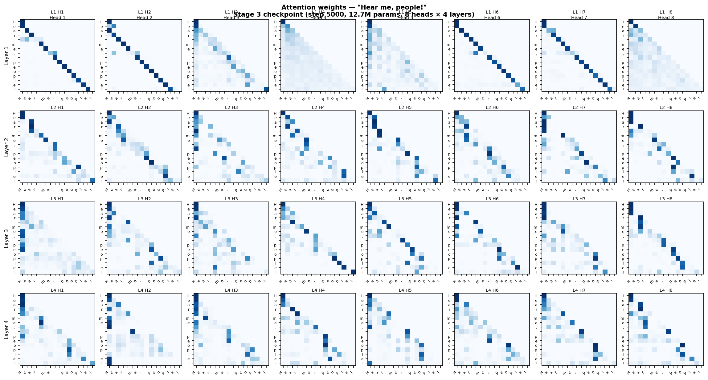

# gpt-from-scratch

Building a GPT from scratch on a MacBook with 8GB RAM. No shortcuts.

## Why
I wanted to understand how LLMs actually work. Not use one. Build one.

## Hardware
MacBook, Apple Silicon, 8GB unified memory. MPS backend for PyTorch.

## Progress

### Stage 1 — Bigram model
- Character-level tokenizer. 65 unique chars.
- 4,225 parameters. Just an embedding table.
- Val loss: 2.52
- Output is garbage but structured garbage. It learned basic char patterns.

### Stage 3 — Full transformer
- Added embeddings, self-attention, feed-forward, LayerNorm, residuals, stacked blocks.
- 12.7M parameters.
- Val loss: 1.54 at 5k steps.
- Generates valid dialogue structure. Not real Shakespeare but close enough to see it's learning.


### What I learned so far
- The feed-forward layer does more than attention. Attention decides where to look, FF does the reasoning.
- Loss table per component is the best way to see what actually matters.
- 8GB is enough if you stay under 15M params.

## What the model actually generates

### Stage 1 — Bigram (3k steps, 4K params)

Random-looking but not fully random. Picks up common characters and some spacing. No real words.

```
FoasE3QUMIMjefxchaPrstRel
O u fZEie by:roursk, COI yeg agnthepr rr Mkecowor chad ge?ofeO,vrFothyLAD &Payo in mppry
way av IFooubT:$zDusickns bokthaNIl-hiNRL:

p, ?w elgne? gaise fre lbustselow!'dcus;
```

### Stage 3 — Transformer on Shakespeare (5k steps, 12.7M params)

Real words. Correct capitalization for character names. Dialogue structure. Not actual Shakespeare, but clearly imitating the format.

```
Nor possess'd Richard Edward kingdom's lap!
'Tis proguised with her gentleman!' 'Tis death,
'Thurish'd thriving kiss'd
That purpulting bears his mother's lodge.

KING RICHARD III:
Then God heaven, man, to pray thee doth their citizens,
Nay, poosolate and brought under thou slander him
And in my boy?
```

### Stage 5 — BPE on mixed corpus (2k steps)

Real words from the training corpus — books, song lyrics, news. Reads like hip-hop lyrics most of the time, which is what the corpus is dominated by. Coherence breaks down after a few lines.

```
Apppedin'
Ing also past people, I took 'til what I'm just ball
If you as hard, you was gone about I try, I got scrable
Tell me, I'm so right now I took
By rap, still smoking a broad ain't born one
I just a ghetto shots on green where the Jang

[ Nas]
Give me no other bills of y'all that nigga will shit
Get her, it sing my Houstons for busing
```

BPE generates real vocabulary words. Char model sounds smoother because it can blend styles more fluidly at the character level.

## What's next
- Stage 5: Train on mixed corpus — screenplays, song lyrics, news articles.
- Option C: Compare BPE tokenizer vs char tokenizer on same corpus.

## Files
- `bigram.py` — Stage 1, bigram model
- `transformer.py` — Stage 3, full GPT
- `download_corpus.py` — Stage 5, pulls books/lyrics/news from HuggingFace
- `train_bpe.py` — Stage 5, trains BPE tokenizer on corpus
- `compare.py` — Stage 5, trains char and BPE models and compares
- `plot_attention.py` — attention weight heatmap from Stage 3 checkpoint
- `diagram.py` — generates the pipeline diagram
- `diagram.png` / `diagram.svg` — pipeline diagram

### Stage 5 — BPE vs Char tokenizer on mixed corpus
Corpus: books (Gutenberg), song lyrics, news articles. ~20MB, ~5M chars.

| Metric | Char | BPE |
|---|---|---|
| val_loss (raw) | 1.73 | 4.81 |
| val_bpc (fair comparison) | 2.49 | 2.04 |
| vocab size | 96 | 8000 |
| context (chars) | 128 | 436 |
| tok/s | not recorded | not recorded |

BPE wins by 18% on BPC. Consistent from step 500 onward, not a fluke.



What I learned:
- Raw val_loss is misleading across tokenizers. BPC is the honest metric.
- The context window advantage is real and intentional — that's what you 
  actually get with BPE in practice.
- Char output sounds more fluent at surface level. BPE generates real words 
  but loses coherence over longer spans.
- We trained BPE fresh on this corpus. A pre-trained modern tokenizer
  on historical text would fragment rare words worse.

## Attention visualization

Input: `"Hear me, people!"` (16 tokens) through the Stage 3 checkpoint.



No head is uniform. The first token (`H`) acts as a dominant attractor across all 4 layers — most tokens in most heads point back to position 0 as their top attention target, likely because it's always reachable and early training anchors on it. Two heads in Layer 1 (H6, H7) look mostly sequential, each token attending to the one before it. Deeper layers show more scattered patterns with no clear structure beyond the position-0 pull.